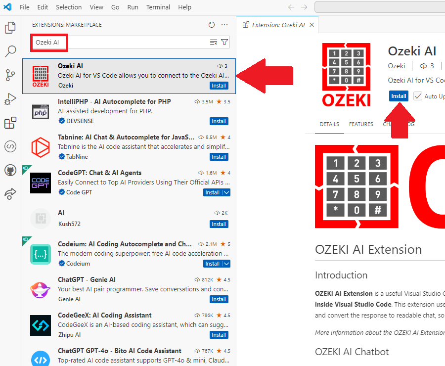
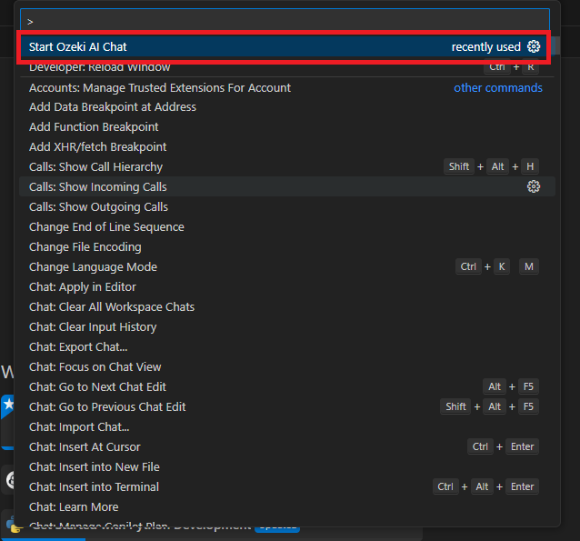
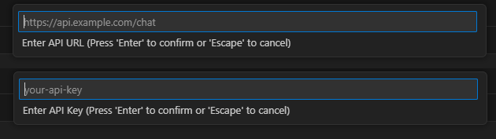
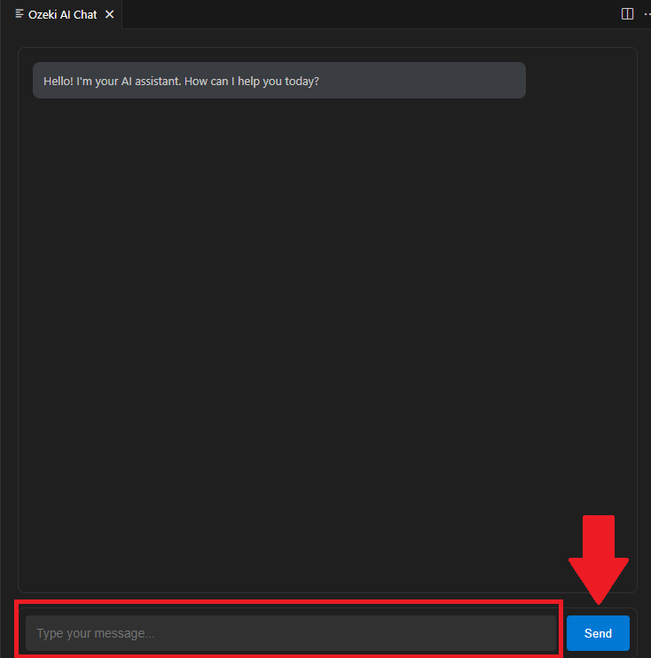

# OZEKI AI Extension
## Introduction
**OZEKI AI Extension** is a useful Visual Studio Code extension for developers to use. This allows you to **talk to your OZEKI Chatbot inside Visual Studio Code**. This extension uses the **API key and the URL of your chatbot to send HTTP requests** using JSON body and convert the response to readable chat, so it can be read easily. 

*More information about the OZEKI AI Extension:* https://ozeki.chat/p_8676-ai-code-generation-vs-code-plugin.html

## OZEKI AI Chatbot
[OZEKI AI Chat](https://ozeki.chat/p_8474-setup-your-local-ai-llms-on-windows.html) offers a powerful and intuitive platform for creating your own custom chatbot using a model of your choice. Using OZEKI AI Studio, the users can easily build and personalize chatbots for their needs. The studio provides an easy-to-use interface that allows you to customize, and deploy your bot. Once created, you can interact with your chatbot directly through OZEKI AI Studio, or even use it in OZEKI Chat.

## Quick steps
**To use OZEKI AI Extension:**
- [Create your chatbot, and get your API url and key](https://ozeki.chat/p_8474-setup-your-local-ai-llms-on-windows.html)
- Download the extension from [Marketplace](https://marketplace.visualstudio.com/items?itemName=Ozeki.ozeki-ai)
- Open VS Code and press CTRL + SHIFT + P and write: **Start Ozeki AI Chat**
- In the input add the API URL and key
- Start chatting with your bot 

## How to use 
Here are the steps to how to use the extension:
### Step 1
**First search and install the Ozeki AI extension:**

### Step 2
**Then start the command for the AI chat:**

### Step 3
**Get your API URL and key ready, because the next step is to input them:**

### Step 4
**Last step, write your prompt in the chat, press send and get your AI generated answer:**

## Manual
To get a better understanding about this **ai chat extension**, and see a visual and easy guide for install, please visit the webpage under this paragraph. This tutorial will help you with videos, and steps including screenshots to make sure you have an easy time to set it up.

Link to the tutorial: [OZEKI AI extension guide](https://ozeki.chat/p_8676-ai-code-generation-vs-code-plugin.html)

## How to transform your computer into a communcation server
[OZEKI Phone System](https://www.ozekiphone.com/) is a software for Windows that turns your computer into a communication server. It allows you to build applications such as PBX, VoIP gateway, IVR, and ACD, providing flexible and efficient communication solutions.

Here is a brief introduction for [OZEKI Phone System](https://www.ozekiphone.com/p_4523-introduction-to-ozeki-phone-system-xe-ip-pbx-software-for-windows.html).

## Get started now
Dont waste any more time. Download the extension and start your chat with your own AI Chatbot now!